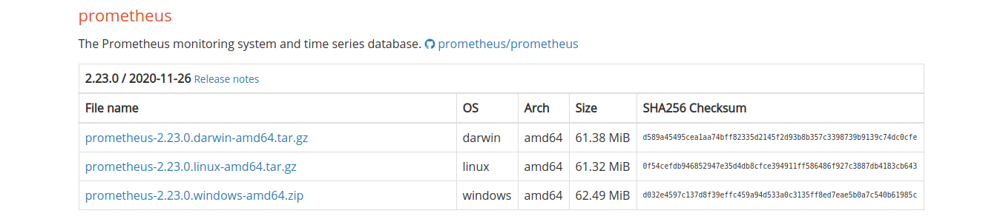
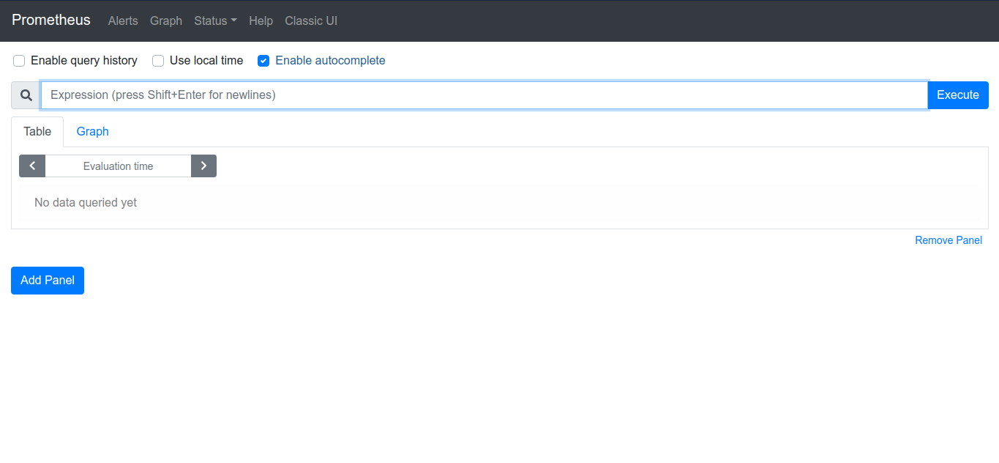
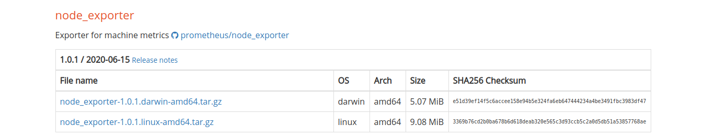
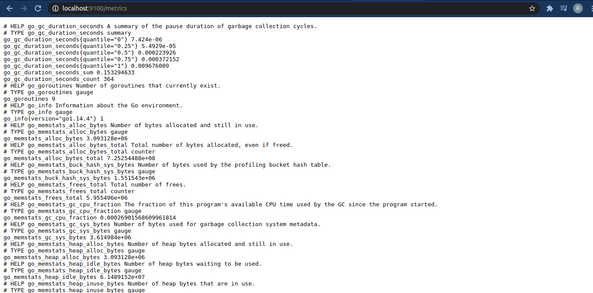

# Prometheus

Prometheus is an open source monitoring tool that enables system engineers to monitor remote servers/services. 


## Introduction

[Introduction to Prometheus](https://www.youtube.com/watch?v=5o37CGlNLr8)


## Setting up Prometheus

To setup Prometheus, we need to have Prometheus server that queries node exporters for server statistics. Each server must have a node exporter installed.


### Setting up the Prometheus monitoring system

#### 1. Download Prometheus

Check out the Prometheus download page and download the appropriate monitoring system for your Operating system [Download page](https://prometheus.io/download/). I am using Ubuntu so I will go ahead and download the monitoring system for Linux as displayed in the image below:



#### 2. Unzip the files and run Prometheus

Switch to the download directory, unzip the files, and run the Prometheus monitoring system.

```bash
# Unzip
tar -xzf prometheus-2.23.0.linux-amd64.tar.gz
# Change directory
cd prometheus-2.23.0.linux-amd64
# Run Prometheus monitoring system
./prometheus
```

To visualize the monitoring system browse to http://localhost:9090 and you will end up with a monitoring system as given below:

|  |
| ------------------------------------------------------------ |

Congratulations! Your monitoring system is up and running.

### Add node exporter to all servers

For this tutorial, I am setting a node exporter for my local system so that the Prometheus monitoring tool can obtain the metrics for my local computer. 

#### 1. Download the node exporter

Check out the Prometheus download page and download the appropriate node exporter for your Operating system [Download page](https://prometheus.io/download/). I am using Ubuntu so I will go ahead and download the node exporter for Linux as displayed in the image below:



#### 2. Unzip and setup the node exporter

Switch to the download directory, unzip the files, and run the Prometheus node exporter.

```bash
# Unzip
tar -xzf node_exporter-1.0.1.linux-amd64.tar.gz
# Change directory
cd node_exporter-1.0.1.linux-amd64
# Run Prometheus node exporter
./node_exporter
```

As a sanity check, browse to http://localhost:9100/metrics on your browser. It should print the device metrics as displayed:

|  |
| :-------------------------------------------------: |

#### 3. Update Prometheus monitoring system configuration file to include node exporter 

We need to update the Prometheus monitoring system configuration file so that it queries the node exporter. 

```bash
# Switch to monitoring tool directory
cd prometheus-2.23.0.linux-amd64
# Edit config file
vim prometheus.yml
```

Under scrape configs add prometheus exporter and target as localhost:9100 as shown (last 5 lines):

```bash
# Code block inside prometheus.yml
# ----------------------- Default block -----------------------------------------------------
scrape_configs:
  # The job name is added as a label `job=<job_name>` to any timeseries scraped from this config.
  - job_name: 'prometheus'
    # metrics_path defaults to '/metrics'
    # scheme defaults to 'http'.
    static_configs:
    - targets: ['localhost:9090']
#-------------------------------------------------------------------------------------------

#------------------------ Append the following block to code ----------------------------------
 # create a new job for the prometheus monitoring system to scrape
 - job_name: 'prometheus_exporter'
    # add exporter locations here
    static_configs:
    - targets: ['localhost:9100']
#--------------------------------------------------------------------------------------------
```

#### 4. Restart Prometheus monitoring system

```bash
# Restart with hangup signal so you dont lose previous monitoring data
kill -s HUP <prometheus-monitoring-tool-pid>
```

